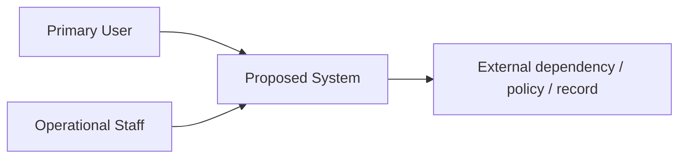

# P00 — Initial Context and Ethics / Confidentiality Check

## 1. Initial Context

> แก้ชื่อกล่องให้ตรงกับกรณีของคุณ

## 2. Initial Assumptions

| Assumption | Why it matters | How to verify |
|---|---|---|
| _เติม_ | _เติม_ | _เติม_ |

## 3. Confidentiality / Privacy Check

- [ ] ฉันจะไม่ใส่ชื่อองค์กรจริงถ้าข้อมูลนั้นไม่เปิดเผยสาธารณะ
- [ ] ฉันจะไม่อัปโหลดเอกสารภายใน ภาพหน้าจอจริง หรือข้อมูลลูกค้าโดยไม่ได้รับอนุญาต
- [ ] ฉันจะใช้นามแฝง/ข้อมูลสรุป/ข้อมูลจำลองเมื่อจำเป็น
- [ ] ฉันจะไม่ส่งข้อมูลอ่อนไหวไปยัง AI
- [ ] ฉันเข้าใจว่า evidence ต้องแยกจากความเห็นหรือข้อสรุปของทีม

## 4. Potential Ethics / Safety / Privacy Issues

| Issue | Who may be affected | Mitigation |
|---|---|---|
| _เติม_ | _เติม_ | _เติม_ |
