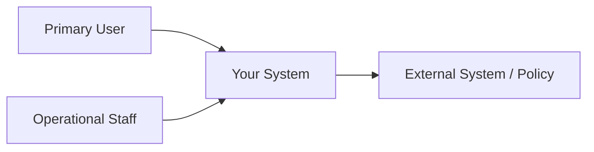

# P02 — Stakeholder, Context and Scope

## Stakeholder Map

| Stakeholder | Role / interest | Goal | Concern / conflict |
|---|---|---|---|
| _เติม_ | _เติม_ | _เติม_ | _เติม_ |

## System Context

## Scope

### In scope
- _เติม_

### Out of scope
- _เติม_

## Constraints and Ethics/Privacy

| Constraint / issue | Impact | Response |
|---|---|---|
| _เติม_ | _เติม_ | _เติม_ |
