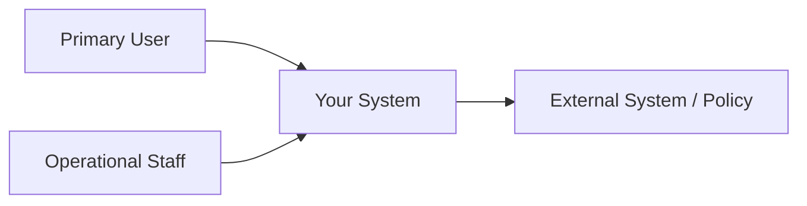

# P02 — Stakeholder, Context and Scope

## Stakeholder Map

| Stakeholder | Role / Interest | Goal | Concern / Conflict |
|------------|----------------|------|-------------------|
| User Requester | ผู้แจ้งปัญหาด้าน IT | แจ้งปัญหาได้ง่ายและติดตามสถานะได้ | งานล่าช้า ไม่ทราบสถานะ |
| IT Support | ผู้รับผิดชอบแก้ไขปัญหา | จัดการงานได้เป็นระบบ | ข้อมูลแจ้งซ่อมไม่ครบถ้วน |
| IT Manager | ผู้ควบคุมและติดตามงาน | ตรวจสอบประสิทธิภาพทีมงาน | ไม่สามารถติดตามภาพรวมงานได้ |
| Purchasing | จัดซื้ออุปกรณ์ IT | จัดซื้ออุปกรณ์ได้ถูกต้องและรวดเร็ว | ข้อมูลความต้องการไม่ชัดเจน |
| Warehouse / Store | จัดการสต็อกอะไหล่และอุปกรณ์ | ควบคุมจำนวนอุปกรณ์คงเหลือ | สต็อกไม่เพียงพอ |
| Management | ผู้บริหาร | ตรวจสอบ KPI และคุณภาพการให้บริการ | ขาดข้อมูลสำหรับตัดสินใจ |
| System Administrator | ดูแลระบบและสิทธิ์ผู้ใช้งาน | ระบบทำงานได้อย่างต่อเนื่อง | ความปลอดภัยและความถูกต้องของข้อมูล |

## System Context

## Scope

### In Scope

- สร้างใบแจ้งซ่อม (Work Order)
- แนบรูปภาพประกอบปัญหา
- ติดตามสถานะงาน
- มอบหมายงานให้ IT Support
- อัปเดตสถานะงาน
- ปิดงานและบันทึกประวัติ
- รายงานสรุปงานเบื้องต้น
- จัดการสิทธิ์ผู้ใช้งาน

### Out of Scope

- ระบบจัดซื้อเต็มรูปแบบ (ERP)
- ระบบบัญชีและการเงิน
- ระบบบริหารทรัพยากรบุคคล (HR)
- ระบบควบคุมสต็อกแบบละเอียด
- Mobile Application
- AI วิเคราะห์ปัญหาอัตโนมัติ

---

## Constraints and Ethics/Privacy

| Constraint / Issue | Impact | Response |
|-------------------|---------|----------|
| งบประมาณจำกัด | ไม่สามารถพัฒนาฟังก์ชันทั้งหมดได้ | พัฒนาเฉพาะฟังก์ชันหลักก่อน |
| เวลาในการพัฒนา | ส่งมอบล่าช้า | กำหนดขอบเขตให้ชัดเจน |
| ผู้ใช้มีทักษะด้าน IT ต่างกัน | ใช้งานระบบยาก | ออกแบบ UI ให้ใช้งานง่าย |
| ข้อมูลส่วนบุคคลของพนักงาน | เสี่ยงต่อการรั่วไหล | กำหนดสิทธิ์การเข้าถึงข้อมูล |
| ความปลอดภัยของข้อมูล | ข้อมูลสูญหายหรือถูกแก้ไข | สำรองข้อมูลและกำหนดสิทธิ์ |
| การใช้ AI ในอนาคต | ผลลัพธ์อาจไม่ถูกต้อง | ให้มนุษย์ตรวจสอบก่อนตัดสินใจ |
