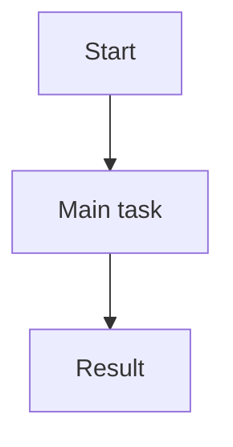

# P07 — Requirement Model

## Chosen model

> เลือก 1–2 แบบจำลองที่ช่วยสื่อสาร requirement สำคัญ เช่น user flow, context, domain model ไม่ต้องทำทุกแบบ

## Domain Terms

| Term | Meaning |
|---|---|
| _เติม_ | _เติม_ |

## Ambiguity / Gap Check

| Item | Why unclear | Next evidence needed |
|---|---|---|
| _เติม_ | _เติม_ | _เติม_ |
