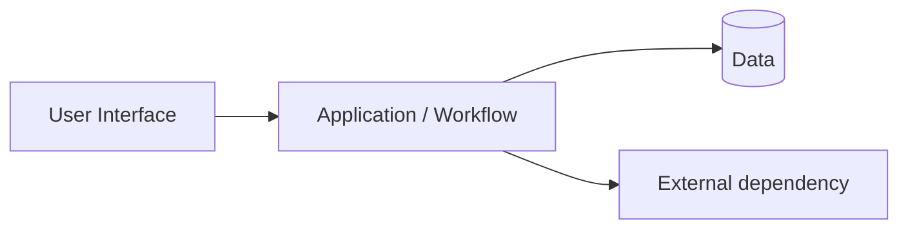

# P13 — Conceptual Architecture

## Components and Responsibilities

| Component | Responsibility | Interfaces / dependencies | Linked requirements |
|---|---|---|---|
| _เติม_ | _เติม_ | _เติม_ | FR-xx |

## Rationale

- _อธิบายว่าทำไมแบ่ง component แบบนี้ โดยอ้าง requirement/NFR_
