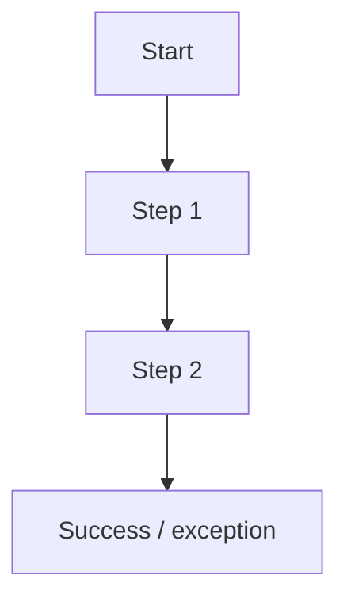

# P14 — User Flow and Prototype

## Primary Task

_ระบุ task สำคัญที่ prototype นี้ต้องช่วยให้สำเร็จ_

## Prototype Link / Asset

- _ใส่ลิงก์ Figma หรือเก็บภาพไว้ใน evidence/prototype แล้วอ้างอิง_

## Usability and Accessibility Notes

| Consideration | Decision | Evidence / rationale |
|---|---|---|
| Error prevention | _เติม_ | _เติม_ |
| Status visibility | _เติม_ | _เติม_ |
| Accessibility | _เติม_ | _เติม_ |
