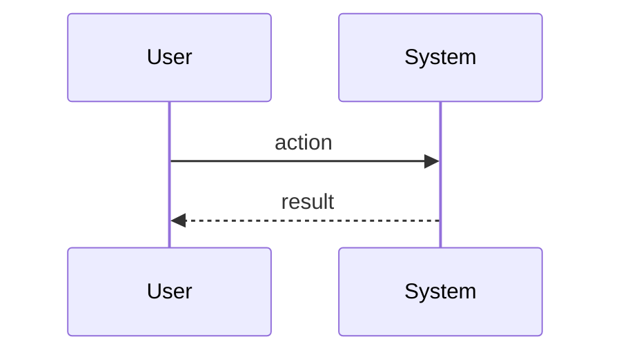

# P16 — Detailed Design Package

## Component Responsibilities

| Component | Input | Output | Rules / validation |
|---|---|---|---|
| _เติม_ | _เติม_ | _เติม_ | _เติม_ |

## Logical Data

| Entity | Important fields | Relationship / note |
|---|---|---|
| _เติม_ | _เติม_ | _เติม_ |

## Interface / API Contract (เลือกเท่าที่จำเป็น)

### `METHOD /path`

**Request**

```json
{}
```

**Response**

```json
{}
```

## Interaction Flow


